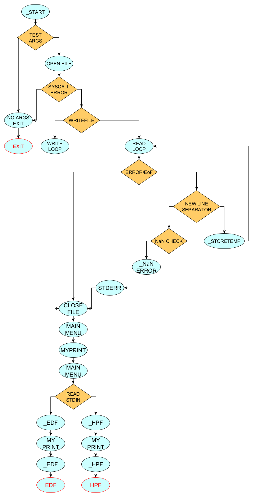

<h3 align="center"><a href="https://github.com/Rick-1242/ElaboratoASM">ELABORATO ASM</a></h3>

  

    software per la pianificazione delle attività di un sistema
produttivo
     

## About The Project
realizzare un programma assembly che riorganizzi i prodotti nel file di input in modo da non sostenere penalità a causa di ritardi.

l'utente può utilizzare 2 algoritmi;

- EDF(Earliest Deadline First): riordina i prodotti in modo che quelli con la scadenza più vicina vengano prodotti per primi
- HPF(Highest Priority First): riordina i prodotti in modo che quelli con la priorità piu alta vengano prodotti per primi
 

(<a href="#readme-top">back to top</a>)

## file

### main

Contiene l'algoritmo per la lettura del file e scrittura sull'array e quello per la stampa a video del menu

### 

(<a href="#readme-top">back to top</a>)

<!-- ROADMAP -->

# main

### _start

- controlla la validità degli argomenti se non ci sono salta all'etichetta _noArgsExit
- salta all'etichetta _openFile

### _openFile

- con una sys call apre il file in modalita di lettura saltando a _readLoop

- in caso di errori della syscall salta a _noArgsExit

### _mainMenu

- utilizza la funzione MyPrint per stampare in stout il menù
- legge da stdin l'imput dell'utente
    - a seconda dell' imput dell'utente salta a
        - _HPF
        - _EDF
        - _exit

### _HPF

- stampa con myPrint mshHPF
- chiama la funzione HPF
- al termine salta a _mainMENU

### _EDF

- stampa con myPrint mshEDF
- chiama la funzione EDF
- al termine salta a _mainMENU

### _readLoop

- legge 1 carattere dal file
- se c'è un errore o il file è finito salta a  _closeFile
- se il carattere non è un numero salta a _NANerr
- se il carattere precedente era un numero lo moltiplica x 10 e lo somma al valore corrente se la somma supera 255 salta a _overFlowDetected
- se il carattere è valido salta a _storeTemp

### _storeTemp

- aggiunge nell'array ordiniArr nella posizione esi

### _overFlowDetected

- stampa in stderr con la funzione MySTDERR overFlowDetectedmsg
- salta a _closeFile

### _noArgsExit

- chiama la funzione mySTDERR per stampare il messaggio noArgsExitmsg:"specificare un filename come argomento e che questo esista"
- salta a _exit

### _NANerr

- chiama mySTDERR per stampare il messaggio MAN: "One of the values provided is Not A Number"

### exit

- fa una sys call per uscire

# generals

### myPrint

- esegue una sys call di scrittura su stdout leggendo il messaggio dallo stack

### mySTDERR

- esegue una sys call di scrittura su stdout leggendo il messaggio dallo stack

---

(<a href="#readme-top">back to top</a>)

